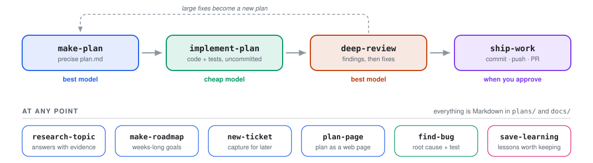

<p align="center">
  
</p>

# 🐒 PAMAGA AGENT TOOLKIT

My personal collection of **agent skills, subagents and commands** for opencode,
Claude Code and Antigravity CLI (`agy`), which I use to build my software tools
and experiments. It exists so that **I stay in control of the development**: I
can understand what is going on, keep learning along the way, and remain **the
owner of the project**.

> [!NOTE]
> **Pre-release.** The toolkit is in `0.x` while I make sure every skill works
> well. It looks very promising and I already use it daily; once I have tested
> it enough, I will release **1.0**. Until then, everyone is welcome to use it
> and to send suggestions as an [issue](../../issues) or a
> [pull request](../../pulls).

## Quick install

You need a coding agent ([Claude Code](https://claude.com/claude-code),
[opencode](https://opencode.ai) or [Antigravity CLI](https://antigravity.google)),
Python 3.9+ and [Git](https://git-scm.com).

**Linux or macOS**

```bash
git clone https://github.com/Pablomg02/pamaga-agent-toolkit.git
cd pamaga-agent-toolkit && ./scripts/install.sh
```

**Windows** (PowerShell)

```powershell
git clone https://github.com/Pablomg02/pamaga-agent-toolkit.git
cd pamaga-agent-toolkit; python scripts\install.py
```

Want the **detailed step-by-step**, a **manual installation**, or have **no
experience with this kind of thing** (no git)? Go to
[INSTALL.md](INSTALL.md).

## Your first minute

1. Run the installer, accept the defaults, and **restart your agent**.
2. Open your agent in any project and type `/make-plan`, or just say
   *"plan a CSV export for this project"*.
3. The agent reads the code, asks you questions until nothing is ambiguous,
   and drafts a `plan.md` under `plans/backlog/` precise enough for a cheap
   model to implement.

Every skill works the same way: say what you want in plain words, or call it
as a slash command. You do not need to learn them upfront; the table below
shows what each one is for.

## What's inside

Ten skills that cover the life of a change, from the first question to the
pull request. You do not need to remember them: each one loads on its own
when your request matches ("plan the CSV export", "ship it"), and each one is
also a slash command (`/make-plan`). Four of them are the main flow; the
rest you call when you need them.

<p align="center">
  <picture>
    <source media="(prefers-color-scheme: dark)" srcset="images/workflow-dark.svg">
    
  </picture>
</p>

| Skill | Use it when | You get |
| --- | --- | --- |
| [`make‑plan`](skills/make-plan/SKILL.md) | A feature, refactor or non-trivial fix needs designing before coding. | A `plan.md` precise enough for a cheap model: tasks, checkable criteria, and one agent or several. A critic on request for large plans. |
| [`implement‑plan`](skills/implement-plan/SKILL.md) | A plan is ready, or a small change is clear enough to build directly. | The code and its tests, with every criterion proven by a command, left uncommitted for you; progress and results logged in the plan if there is one. |
| [`deep‑review`](skills/deep-review/SKILL.md) | Before merging, or to audit existing code. | Checked findings at the depth you choose; small fixes applied with tests, large ones fixed or turned into a plan. |
| [`ship‑work`](skills/ship-work/SKILL.md) | The work is done. | Commits, and if you want, a push and a pull request. You choose how far. |
| [`research‑topic`](skills/research-topic/SKILL.md) | You need an answer before deciding: "can we use X?", "how does Y work here?" | An answer backed by code and sources. One agent by default, several in parallel only when the question splits; saved only if you ask. |
| [`make‑roadmap`](skills/make-roadmap/SKILL.md) | The goal takes weeks or months. | A roadmap: milestones with exit criteria and the plans to derive from them. |
| [`new‑ticket`](skills/new-ticket/SKILL.md) | Something should be done, but not now. | A ticket in the backlog, in a minute. |
| [`plan‑page`](skills/plan-page/SKILL.md) | You want to read or share a plan at a glance. | A self-contained `plan.html` in the plan's folder. |
| [`find‑bug`](skills/find-bug/SKILL.md) | Something fails and the cause is not obvious. | The root cause, a fix, and a regression test. |
| [`save‑learning`](skills/save-learning/SKILL.md) | You learned something worth remembering. | A short note in `docs/learnings/` that cites the plan it came from. |

Everything the skills write lives in your repository, as plain Markdown:

```
plans/
├── backlog/        plans, roadmaps and tickets not started yet
├── in-progress/    being implemented
└── done/           closed, with results
docs/
├── research/       saved research-topic reports
└── learnings/      save-learning notes
```

A plan's folder holds everything about it: `plan.md`, research, critique,
page. The layout is defined by `plans-convention`, a supporting skill the
others load on their own; it has no command.

## Philosophy

Simplicity is the point. These skills are not meant to box the agent in with
rigid restrictions: they nudge it toward a few basic organizational patterns
that keep the flow from idea to development to validation easy. They are plain,
model-agnostic Markdown, so the same skill works with any agent or model, and
when an instruction closes off options or adds ceremony without value, it does
not belong here.

One of the fundamental ideas behind these skills is working with two or more
models at once: I keep decisions with the best model I have (at the time of
writing, Opus 5.5 with high effort) and leave implementation to a cheap but
capable one (in this case, DeepSeek v4.1 flash), with as few subagents and
calls as possible so as not to burn tokens.

Why that is safe, and how the skills are shaped around it, is in
[docs/PHILOSOPHY.md](docs/PHILOSOPHY.md).

## Update and uninstall

From the clone:

```bash
python3 scripts/install.py --update --pull   # git pull, then update what you installed
python3 scripts/install.py --status          # what is installed where, and what changed
./scripts/install.sh --uninstall all         # remove only what the toolkit installed
```

The installer installs symlinks by default, so `git pull` updates everything
in place, or real copies, which it tracks so it can tell *up to date*,
*outdated* and *edited locally* apart. Versions come from the git tags; no
version numbers are stored in the files. On Windows use `python` instead of
`python3`. Restart your agent after any change.

Prefer to do it by hand? It is just copying Markdown files: see the
[manual installation guide](docs/INSTALL.md) for locations, commands and every
installer flag.

## Development

Conventions for writing skills, commands and agents are in
[docs/CONVENTIONS.md](docs/CONVENTIONS.md). Before committing:

```bash
python3 scripts/validate.py              # --fix regenerates opencode wrappers
python3 -m unittest discover -s tests
```

Each skill has behaviour and trigger cases in [evals/](evals/README.md).
The workflow diagram is generated: after adding or renaming a skill, update
`scripts/draw_workflow.py` and run it (a test fails while it is outdated).

Every push to `main` that passes CI is released as `0.MINOR.PATCH` (`MINOR`
by default, `PATCH` when a commit says `[patch]`); see
[Releases](https://github.com/Pablomg02/pamaga-agent-toolkit/releases).
`dev` is the working branch: it has no tags or releases, and its version is
just its commit.
